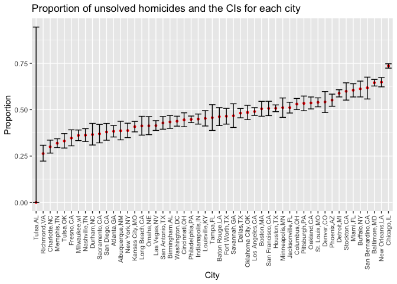
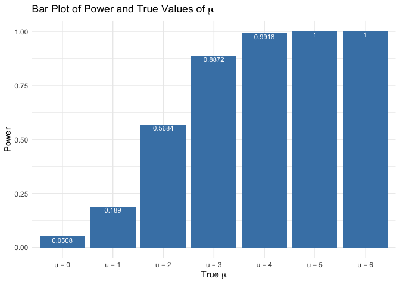
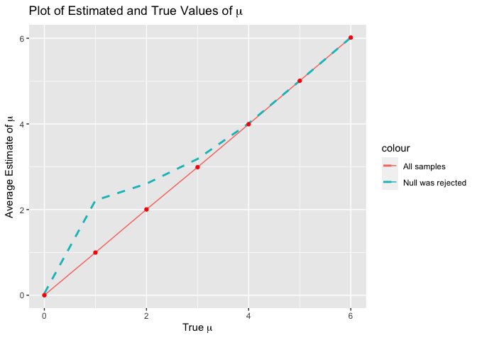

Homework 5
================
Yining Chen
2022-11-13

``` r
library(tidyverse)
library(broom)
library(purrr)
```

## Problem 2

This data records homicides in 50 large U.S. cities which contains 52179
observations and 12 variables. The variables including case id, reported
date of murder, victim’s last name, victim’s first name, victim’s race,
victim’s age, victim’s sex, city, state, latitidue, longitude, and
disposition of the case.

``` r
homicide <- read_csv("https://raw.githubusercontent.com/washingtonpost/data-homicides/master/homicide-data.csv")

homicide <- homicide%>%
  mutate(city_state=str_c(city, ",",state))%>%
  relocate(city_state)
  

homicide %>%
  group_by(city) %>%
  summarise(
    unsolved = sum(disposition=="Closed without arrest"| disposition =="Open/No arrest"),
    n = n()) %>%
  knitr::kable(col.names = c("City", "Unsolved Homicides", "Total Homicides"))
```

| City           | Unsolved Homicides | Total Homicides |
|:---------------|-------------------:|----------------:|
| Albuquerque    |                146 |             378 |
| Atlanta        |                373 |             973 |
| Baltimore      |               1825 |            2827 |
| Baton Rouge    |                196 |             424 |
| Birmingham     |                347 |             800 |
| Boston         |                310 |             614 |
| Buffalo        |                319 |             521 |
| Charlotte      |                206 |             687 |
| Chicago        |               4073 |            5535 |
| Cincinnati     |                309 |             694 |
| Columbus       |                575 |            1084 |
| Dallas         |                754 |            1567 |
| Denver         |                169 |             312 |
| Detroit        |               1482 |            2519 |
| Durham         |                101 |             276 |
| Fort Worth     |                255 |             549 |
| Fresno         |                169 |             487 |
| Houston        |               1493 |            2942 |
| Indianapolis   |                594 |            1322 |
| Jacksonville   |                597 |            1168 |
| Kansas City    |                486 |            1190 |
| Las Vegas      |                572 |            1381 |
| Long Beach     |                156 |             378 |
| Los Angeles    |               1106 |            2257 |
| Louisville     |                261 |             576 |
| Memphis        |                483 |            1514 |
| Miami          |                450 |             744 |
| Milwaukee      |                403 |            1115 |
| Minneapolis    |                187 |             366 |
| Nashville      |                278 |             767 |
| New Orleans    |                930 |            1434 |
| New York       |                243 |             627 |
| Oakland        |                508 |             947 |
| Oklahoma City  |                326 |             672 |
| Omaha          |                169 |             409 |
| Philadelphia   |               1360 |            3037 |
| Phoenix        |                504 |             914 |
| Pittsburgh     |                337 |             631 |
| Richmond       |                113 |             429 |
| Sacramento     |                139 |             376 |
| San Antonio    |                357 |             833 |
| San Bernardino |                170 |             275 |
| San Diego      |                175 |             461 |
| San Francisco  |                336 |             663 |
| Savannah       |                115 |             246 |
| St. Louis      |                905 |            1677 |
| Stockton       |                266 |             444 |
| Tampa          |                 95 |             208 |
| Tulsa          |                193 |             584 |
| Washington     |                589 |            1345 |

``` r
prop.test(x=1825, n=2827) %>% broom::tidy()
```

    ## # A tibble: 1 × 8
    ##   estimate statistic  p.value parameter conf.low conf.high method        alter…¹
    ##      <dbl>     <dbl>    <dbl>     <int>    <dbl>     <dbl> <chr>         <chr>  
    ## 1    0.646      239. 6.46e-54         1    0.628     0.663 1-sample pro… two.si…
    ## # … with abbreviated variable name ¹​alternative

``` r
prop_test <- function(df) {
  
  city_sum <- df %>%
  summarise(
    unsolved = sum(disposition=="Closed without arrest"| disposition =="Open/No arrest"),
    n = n()
  )

  test <- prop.test(
    x = city_sum %>% pull(unsolved),
    n = city_sum %>% pull(n))
  return(test)
}
```

``` r
results = 
  homicide %>%
  nest(data = uid:disposition) %>%
  mutate(
    tests = map(data, prop_test),
    tidy_tests = map(tests, broom::tidy)
    ) %>% 
    select(city_state, tidy_tests) %>% 
    unnest(tidy_tests) %>% 
    select(city_state, estimate, starts_with("conf"))

head(results) %>% 
  knitr::kable()
```

| city_state     |  estimate |  conf.low | conf.high |
|:---------------|----------:|----------:|----------:|
| Albuquerque,NM | 0.3862434 | 0.3372604 | 0.4375766 |
| Atlanta,GA     | 0.3833505 | 0.3528119 | 0.4148219 |
| Baltimore,MD   | 0.6455607 | 0.6275625 | 0.6631599 |
| Baton Rouge,LA | 0.4622642 | 0.4141987 | 0.5110240 |
| Birmingham,AL  | 0.4337500 | 0.3991889 | 0.4689557 |
| Boston,MA      | 0.5048860 | 0.4646219 | 0.5450881 |

``` r
results%>% 
  mutate(city_state = fct_reorder(city_state, estimate)) %>% 
  ggplot(aes(x = city_state, y = estimate)) +
  geom_point(color="red",size=1) +
  geom_errorbar(aes(ymin = conf.low, ymax = conf.high)) +  
  theme(axis.text.x = element_text(size = 8, angle = 90, vjust = 0.5, hjust = 1))+
  xlab("City")+
  ylab("Proportion")+
  ggtitle("Proportion of unsolved homicides and the CIs for each city")
```

<!-- -->

## Problem 3

``` r
set.seed(1)

sim_mean = function(n, mu = 0, sigma = 5) {
  
  sim_data = tibble(
    x = rnorm(n, mean = mu, sd = sigma),
  )
  
  sim_data %>% 
    summarize(
      mu_hat = mean(x),
      p_value = broom::tidy(t.test(x, mu = 0))[3]
    )
}

output = vector("list", 5000)

for (i in 1:5000) {
  output[[i]] = sim_mean(30)

}

sim_results = bind_rows(output)
```

``` r
set.seed(1)
sim_results_df = 
  expand_grid(
    true_mu = c(0:6),
    iter = 1:5000
  ) %>% 
  mutate(
    estimate_df = map(.x = true_mu, ~ sim_mean(30,mu = .x))
  ) %>% 
  unnest(estimate_df)
```

``` r
sim_results_df <- sim_results_df %>% 
  mutate(p.value=p_value$p.value)%>%select(1,3,5)
```

``` r
proportions = sim_results_df%>% filter(p.value<0.05)%>%group_by(true_mu)%>%summarise(n=n())

power <- data.frame (mu  = str_c("u = ", c(0:6)),
                  proportion=proportions$n/5000
                  )
```

``` r
ggplot(data=power, aes(x=mu, y=proportion)) +
  geom_bar(stat="identity",fill="steelblue")+
  theme_minimal()+
  xlab(expression(paste("True ", mu)))+
  ylab("Power")+
  ggtitle(expression(paste("Bar Plot of Power and True Values of ", mu)))+
  geom_text(aes(label=proportion), vjust=1.2, color="white",
            position = position_dodge(0.9), size=3)
```

<!-- -->
From the above bar plot, we can tell that the proportion of times the
null was rejected increases as the true value of μ gets larger. When μ
is equal to 4,the proportion approximately reaches to 1. There is a
positive asscociation between effect size and power. Therefore, to
increase the power of our study, we could use potent interventions that
have bigger effects. .

``` r
est_mu <- sim_results_df %>% 
  pivot_longer(
    mu_hat,
    names_to = "parameter", 
    values_to = "estimate") %>% 
  group_by(parameter, true_mu) %>% 
  summarize(
    emp_mean = mean(estimate))
```

    ## `summarise()` has grouped output by 'parameter'. You can override using the
    ## `.groups` argument.

``` r
est_mu_rej <- sim_results_df %>% 
  filter(p.value<0.05)%>%
  pivot_longer(
    mu_hat,
    names_to = "parameter", 
    values_to = "estimate") %>% 
  group_by(parameter, true_mu) %>% 
  summarize(
    emp_mean_rej = mean(estimate))
```

    ## `summarise()` has grouped output by 'parameter'. You can override using the
    ## `.groups` argument.

``` r
total <- merge(est_mu,est_mu_rej,by=c("true_mu"))%>%select(1,3,5)

ggplot(total,aes(x=true_mu, y=emp_mean)) +
  geom_line(aes(color="All samples"))+
  geom_line(aes(y = emp_mean_rej,color="Null was rejected"),linetype="dashed",size=1)+
  xlab(expression(paste("True ", mu)))+
  ylab(expression(paste("Average Estimate of ", mu)))+
    geom_point(color = "red")+
  ggtitle(expression(paste("Plot of Estimated and True Values of ", mu)))
```

<!-- -->
The sample average of μ̂ across tests for which the null is rejected is
not approximately equal to the true value of μ when μ is small. This is
because when the value of μ is close to the hypothesized value of zero,
there is only a small proportion of tests for which the null is
rejected. Among those tests, μ̂ is not likely to be close to the true
value.
